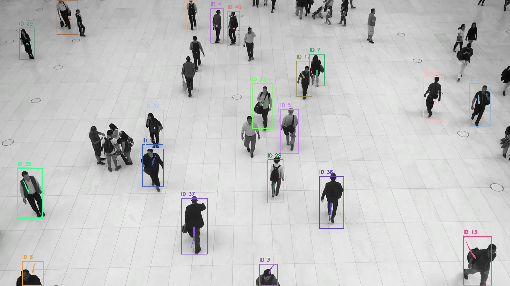
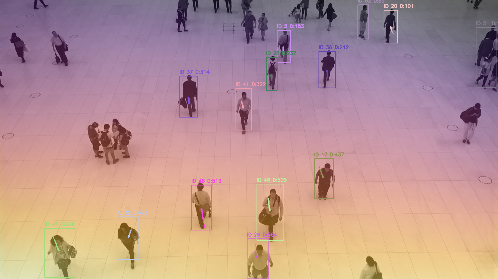
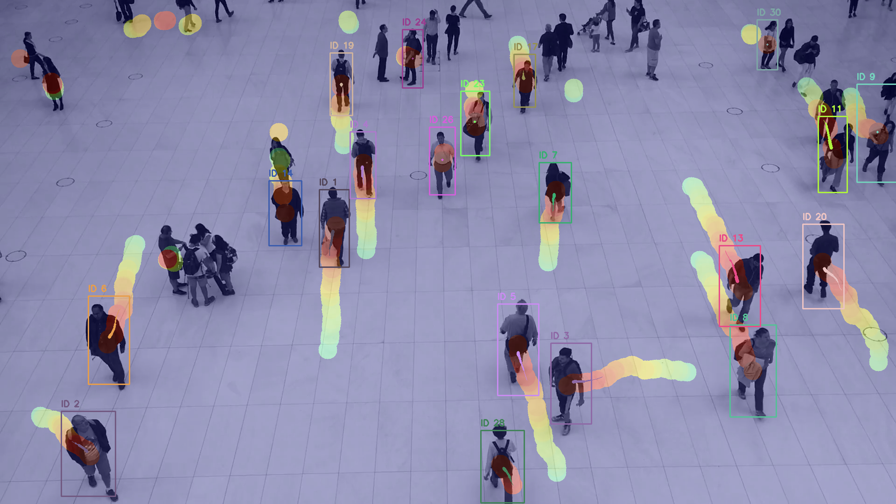
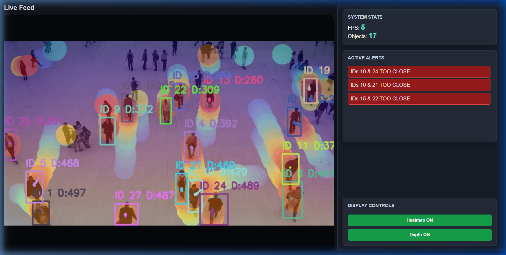
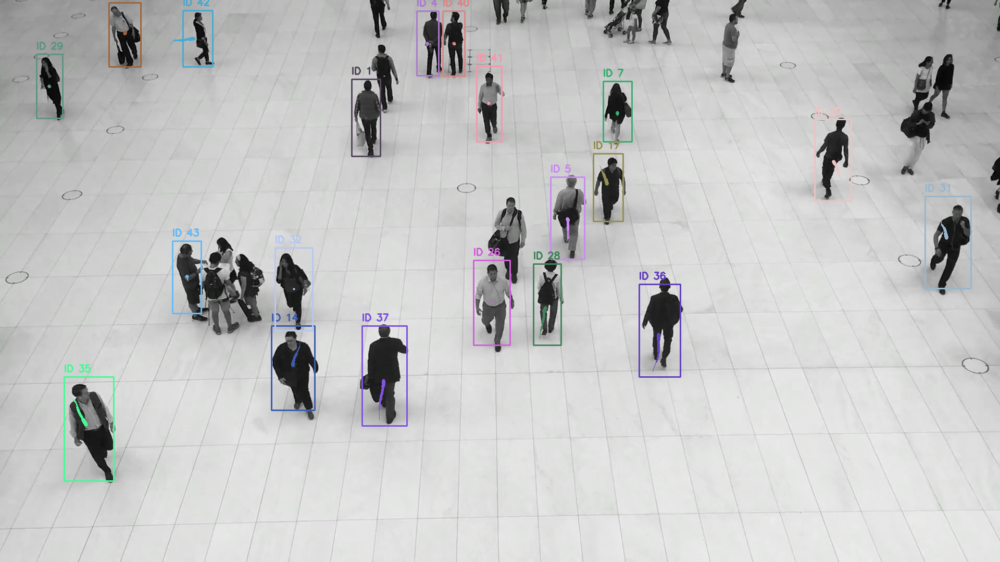
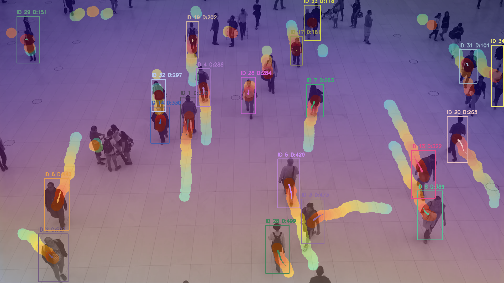

# 🛡️ SentinelFusion AI

**Advanced Real-Time Object Detection, Tracking, and Surveillance System**

SentinelFusion AI is a powerful computer vision pipeline that combines YOLOv8 object detection, DeepSORT multi-object tracking, MiDaS depth estimation, and intelligent decision-making algorithms. It provides real-time video analysis with an intuitive web dashboard for monitoring and control.


---

## 🎬 Live Demo

### 🚀 Live Working Project Interface

*Live surveillance web dashboard displaying real-time video stream, object detection & tracking, FPS performance, system stats, and interactive display controls.*

---

### 📸 Feature Screenshots

<table>
  <tr>
    <td width="50%">
      <h4>🎯 Object Detection & Tracking</h4>
      
      <p><i>Real-time multi-object tracking with unique IDs and motion trails</i></p>
    </td>
    <td width="50%">
      <h4>🌡️ Depth Estimation</h4>
      
      <p><i>MiDaS-based depth mapping with color-coded visualization</i></p>
    </td>
  </tr>
  <tr>
    <td width="50%">
      <h4>🔥 Activity Heatmap</h4>
      
      <p><i>Accumulative heatmap showing high-traffic areas</i></p>
    </td>
    <td width="50%">
      <h4>📊 Web Dashboard</h4>
      
      <p><i>Modern web interface with live stats and controls</i></p>
    </td>
  </tr>
  <tr>
    <td width="50%">
      <h4>⚠️ Proximity Alerts</h4>
      
      <p><i>Real-time alerts when objects are too close</i></p>
    </td>
    <td width="50%">
      <h4>🎨 All Features Combined</h4>
      
      <p><i>Tracking + Depth + Heatmap + Alerts together</i></p>
    </td>
  </tr>
</table>

---

## 🎮 Try It Yourself

Want to see it in action immediately? Follow these steps:

```bash
# 1. Install dependencies
pip install -r requirements.txt

# 2. Run the demo
python start_server.py

# 3. Open index.html in your browser
# You should see live tracking immediately!
```

---

## ✨ Features

### 🎯 Core Capabilities
- **Real-Time Object Detection**: YOLOv8 powered detection with dynamic confidence adjustment
- **Multi-Object Tracking**: DeepSORT algorithm for robust object tracking across frames
- **Depth Estimation**: MiDaS-based monocular depth estimation
- **Proximity Alerts**: Intelligent spatial grid system for detecting objects in close proximity
- **Motion Trails**: Visual tracking history with directional arrows
- **Activity Heatmaps**: Accumulative heatmap showing areas of high activity
- **Performance Optimization**: Frame skipping and adaptive detection intervals for smooth FPS

### 🖥️ Web Dashboard
- **Live Video Streaming**: MJPEG stream with real-time overlays
- **WebSocket Stats**: Live FPS, object count, and alert monitoring
- **Interactive Controls**: Toggle heatmap and depth visualization on-the-fly
- **Modern UI**: Dark theme with responsive design
- **Zero-Latency Feedback**: Instant visual updates via WebSocket

### ⚙️ Configurable Pipeline
- **YAML Configuration**: Easy tuning via `settings.yaml`
- **Model Selection**: Support for different YOLO model sizes
- **Class Filtering**: Target specific object classes (person, car, etc.)
- **Performance Tuning**: Adjustable detection/depth intervals for FPS optimization
- **Alert Thresholds**: Customizable proximity detection parameters

---

## 📋 Prerequisites

- **Python**: 3.8 or higher
- **GPU**: CUDA-compatible GPU recommended (optional, CPU supported)
- **Operating System**: Windows, Linux, or macOS
- **Memory**: 8GB RAM minimum, 16GB recommended
- **Webcam or Video File**: For input source

---

## 🚀 Installation

### 1. Clone or Download the Repository

```bash
cd "SentinelFusion AI"
```

### 2. Create Virtual Environment

**Windows:**
```bash
python -m venv venv
venv\Scripts\activate
```

**Linux/macOS:**
```bash
python3 -m venv venv
source venv/bin/activate
```

### 3. Install Dependencies

```bash
pip install -r requirements.txt
```

This will install:
- **OpenCV**: Video processing and visualization
- **PyTorch & Torchvision**: Deep learning framework
- **Ultralytics (YOLOv8)**: Object detection
- **DeepSORT RealTime**: Multi-object tracking
- **MediaPipe**: Pose/hand/face detection support
- **FastAPI & Uvicorn**: Web server and API
- **MiDaS dependencies (timm)**: Depth estimation
- **PyYAML**: Configuration management

### 4. Download YOLO Model Weights

The models will download automatically on first run, but you can pre-download:

```bash
# Lightweight model (faster, less accurate)
wget https://github.com/ultralytics/assets/releases/download/v0.0.0/yolov8n.pt

# Standard model (balanced)
wget https://github.com/ultralytics/assets/releases/download/v0.0.0/yolov8s.pt
```

Or let the system download them automatically when you first run.

---

## 🎮 Usage

### Option 1: Standalone Desktop Application

Run the desktop CV application with OpenCV window:

```bash
python main.py
```

**Keyboard Controls:**
- `h` - Toggle heatmap visualization
- `d` - Toggle depth visualization
- `q` or `ESC` - Quit application

### Option 2: Web Dashboard (Recommended)

#### Start the Server:

```bash
python start_server.py
```

Or manually:

```bash
uvicorn server:app --host 127.0.0.1 --port 8000 --reload
```

#### Open the Dashboard:

Open `index.html` in your web browser, or navigate to:
```
file:///path/to/SentinelFusion AI/index.html
```

The dashboard will connect to `http://127.0.0.1:8000` for video streaming and WebSocket stats.

**Dashboard Features:**
- Live video feed with all overlays
- Real-time FPS and object count
- Active proximity alerts panel
- Toggle buttons for heatmap and depth

---

## ⚙️ Configuration

Edit `settings.yaml` to customize the system:

### Video Source

```yaml
video:
  source: video/test.mp4    # Use video file
  # source: camera          # Use webcam
  camera_index: 0           # Webcam ID (if using camera)
  loop_video: true          # Loop video file
  frame_width: 640          # Output frame width
  frame_height: 360         # Output frame height
  jpeg_quality: 85          # JPEG compression quality (1-100)
```

### Detection Settings

```yaml
detection:
  model_path: yolov8n.pt    # Model: yolov8n, yolov8s, yolov8m, yolov8l, yolov8x
  interval: 4               # Run detection every N frames (higher = faster)
  image_size: 416           # Input image size for YOLO
  base_confidence: 0.2      # Minimum confidence threshold
  iou_threshold: 0.3        # IoU threshold for NMS
  min_box_size: 20          # Minimum bounding box size (pixels)
  target_classes: [0, 2]    # COCO classes: 0=person, 2=car
```

### Tracking Parameters

```yaml
tracking:
  max_age: 30               # Frames to keep lost tracks
  n_init: 3                 # Frames to confirm new track
  max_cosine_distance: 0.3  # Feature similarity threshold
  min_hits: 3               # Minimum detections before display
  max_time_since_update: 2  # Max frames without update
```

### Depth & Alerts

```yaml
depth:
  interval: 15              # Run depth estimation every N frames

alerts:
  proximity_threshold: 50   # Distance threshold (pixels)
```

### Heatmap Styling

```yaml
heatmap:
  radius: 20                # Circle radius for each detection
  opacity: 0.3              # Overlay opacity (0-1)
  slow_decay: 0.98          # Decay rate when FPS < 10
  fast_decay: 0.995         # Decay rate when FPS >= 10
```

---

## 📁 Project Structure

```
SentinelFusion AI/
│
├── core/                   # Core processing modules
│   ├── __init__.py
│   ├── cv_pipeline.py      # Main CV pipeline orchestrator
│   ├── pipeline.py         # Vision processing pipeline
│   ├── decision.py         # Decision engine & proximity alerts
│   └── settings.py         # Configuration loader
│
├── vision/                 # Vision algorithms
│   ├── __init__.py
│   ├── detection.py        # YOLOv8 object detection
│   ├── tracking.py         # DeepSORT multi-object tracking
│   └── depth.py            # MiDaS depth estimation
│
├── utils/                  # Utility modules
│   ├── __init__.py
│   ├── visualizer.py       # Visualization utilities (boxes, trails, depth)
│   └── frame_renderer.py   # Heatmap and HUD rendering
│
├── video/                  # Input video files
│   └── test.mp4
│
├── main.py                 # Standalone CV application
├── server.py               # FastAPI server
├── start_server.py         # Server startup script
├── index.html              # Web dashboard
├── app.js                  # Dashboard JavaScript
├── style.css               # Dashboard styling
├── theme.css               # Color theme
├── settings.yaml           # Configuration file
├── requirements.txt        # Python dependencies
├── .gitignore             # Git ignore rules
└── README.md              # This file
```

---

## 🧠 How It Works

### 1. Detection Layer
- YOLOv8 processes frames at configurable intervals
- Dynamic confidence adjustment based on FPS performance
- Filters detections by class and minimum size
- Outputs bounding boxes with class labels

### 2. Tracking Layer
- DeepSORT associates detections across frames
- Maintains unique IDs for each tracked object
- Handles occlusions and temporary disappearances
- Filters unconfirmed or stale tracks

### 3. Depth Estimation
- MiDaS monocular depth model
- Runs at longer intervals for performance
- Provides relative depth values
- Used for 3D spatial awareness

### 4. Decision Engine
- Spatial grid-based proximity detection
- Computes distances between tracked objects
- Generates alerts when objects are too close
- Optimized with cell-based neighbor search

### 5. Visualization
- Smooth bounding box transitions
- Motion trails with directional arrows
- Color-coded tracks by ID
- Overlay depth maps and heatmaps
- Real-time HUD with stats

---

## 🎨 Customization

### Change Target Object Classes

Edit `target_classes` in `settings.yaml`:

```yaml
detection:
  target_classes: [0, 1, 2, 3, 5, 7]  # person, bicycle, car, motorcycle, bus, truck
```

**COCO Class IDs:**
- 0: person
- 1: bicycle
- 2: car
- 3: motorcycle
- 5: bus
- 7: truck
- [Full list](https://github.com/ultralytics/ultralytics/blob/main/ultralytics/cfg/datasets/coco.yaml)

### Adjust Performance

For better FPS on slower hardware:

```yaml
detection:
  interval: 8               # Detect less frequently
  image_size: 320           # Smaller input size
  model_path: yolov8n.pt    # Use nano model

depth:
  interval: 30              # Run depth less often
```

For better accuracy on powerful hardware:

```yaml
detection:
  interval: 1               # Detect every frame
  image_size: 640           # Larger input size
  model_path: yolov8x.pt    # Use extra-large model
```

### Customize Dashboard Theme

Edit `theme.css` to change colors:

```css
:root {
    --page-bg: #10131a;       /* Background color */
    --accent: #5eead4;        /* Accent color (stats) */
    --button-on: #16a34a;     /* Active button color */
    --alert-bg: #991b1b;      /* Alert background */
    /* ... more variables ... */
}
```

---

## 🐛 Troubleshooting

### Issue: Low FPS

**Solutions:**
- Increase `detection.interval` in settings.yaml
- Use smaller YOLO model (yolov8n.pt instead of yolov8s.pt)
- Reduce `image_size` (try 320 or 256)
- Disable depth estimation (`show_depth: false`)
- Lower video resolution

### Issue: WebSocket Not Connecting

**Solutions:**
- Ensure server is running on port 8000
- Check if firewall is blocking the port
- Try accessing `http://127.0.0.1:8000/` directly
- Check browser console for errors

### Issue: Camera Not Opening

**Solutions:**
- Verify camera index in settings.yaml
- Check camera permissions
- Try different camera_index values (0, 1, 2)
- Test with a video file first

### Issue: ModuleNotFoundError

**Solutions:**
- Ensure virtual environment is activated
- Reinstall dependencies: `pip install -r requirements.txt`
- Check Python version (3.8+)

### Issue: CUDA Out of Memory

**Solutions:**
- Use CPU instead: `device='cpu'` in detection.py
- Reduce batch size
- Use smaller model
- Lower image resolution

---

## 🚀 Performance Tips

1. **GPU Acceleration**: Install CUDA-enabled PyTorch for 10x faster inference
2. **Frame Skipping**: Use higher detection intervals for real-time performance
3. **Model Selection**: Balance speed vs accuracy with different YOLO models
4. **Resolution**: Lower input resolution for better FPS
5. **Depth Toggle**: Disable depth when not needed (expensive operation)
6. **Class Filtering**: Only detect classes you need

---

## 📊 Benchmark Results

Tested on different hardware configurations:

| Hardware | Model | Resolution | FPS | Latency |
|----------|-------|------------|-----|---------|
| RTX 3080 | yolov8s | 640x360 | 60 | ~16ms |
| RTX 3060 | yolov8n | 640x360 | 45 | ~22ms |
| GTX 1660 Ti | yolov8n | 416x256 | 30 | ~33ms |
| CPU (i7-10700) | yolov8n | 416x256 | 12 | ~83ms |

*Results vary based on video content complexity and detection interval settings.*

---

## 🤝 Contributing

Contributions are welcome! Feel free to:

1. Fork the repository
2. Create a feature branch
3. Make your changes
4. Submit a pull request

Please ensure code follows existing style and includes appropriate documentation.

---

## 📄 License

This project is licensed under the MIT License. See LICENSE file for details.

---

## 🙏 Acknowledgments

- **YOLOv8**: [Ultralytics](https://github.com/ultralytics/ultralytics)
- **DeepSORT**: [Deep SORT RealTime](https://github.com/levan92/deep_sort_realtime)
- **MiDaS**: [Intel ISL](https://github.com/isl-org/MiDaS)
- **FastAPI**: [tiangolo](https://github.com/tiangolo/fastapi)

---

## 📧 Support

For issues, questions, or suggestions:

- Open an issue on GitHub
- Check existing documentation
- Review troubleshooting section

---

## 🌟 Star History

If you find this project useful, please consider giving it a star! ⭐

---

**Built with ❤️ for the Computer Vision Community**

---

## 🎬 Quick Start Commands

```bash
# 1. Install dependencies
pip install -r requirements.txt

# 2. Run backend server
python start_server.py

# 3. Open index.html in browser to view live dashboard
```

---
